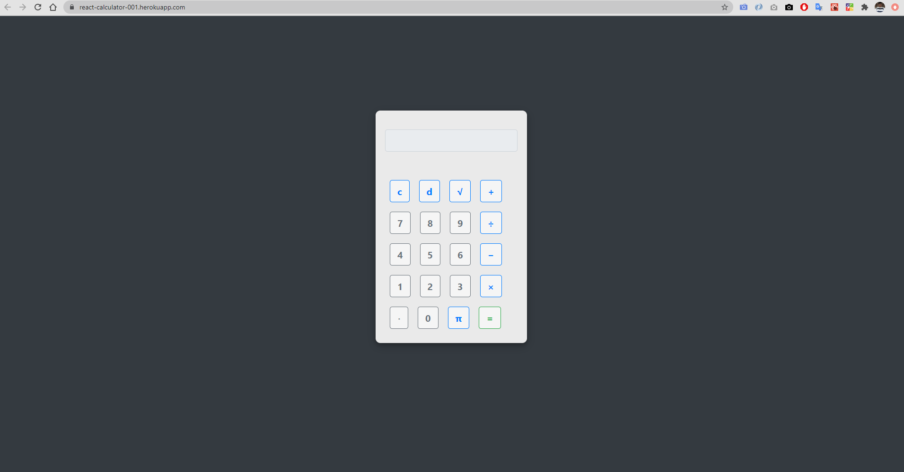

# React Calculator
This project was bootstrapped with [Create React App](https://github.com/facebook/create-react-app).

Live test URL.<br />
https://react-calculator-001.herokuapp.com/

<p align="center">
  
</p>

## Development

To get a local copy of the code, clone it using git:

```
git clone https://github.com/musa-bello/react-calculator
cd react-calculator
```

Install dependencies:

```
npm install
```

Finally, you need to start a local web server. Run:

```
npm start
```